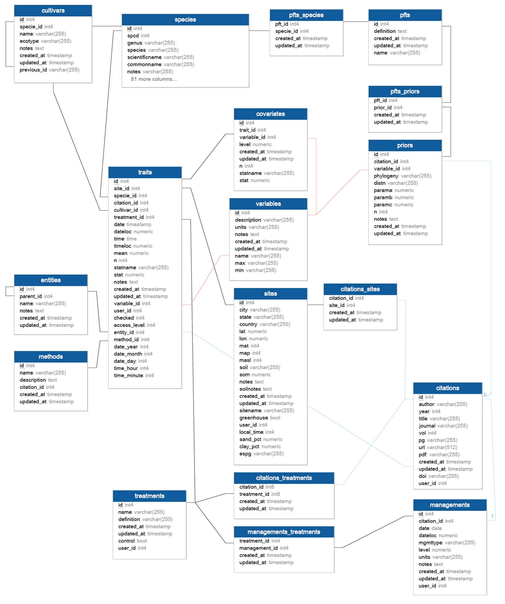

# SQL queries

The BETYdb repository has a large number of example SQL queries if you search for the terms ['select' and 'join' in its issues](https://github.com/pecanproject/bety/issues?utf8=%E2%9C%93&q=is%3Aissue+select+where+join).

SQL is the most flexible way of querying data from BETYdb. 
The l[ist of tables](https://www.betydb.org/schemas) and [schema](https://www.betydb.org/schemas?partial=relationships) at  and a list of tables at [https://betydb.org/schemas](https://www.betydb.org/schemas).

These are the core tables required to query traits and yields:





We have created 'views' to make it easier to query data from multiple tables. 
For example, to lookup the name and location of a site or the names and units of variables. 
The following query joins multiple tables, and is based on the yieldsview table:

```sql
SELECT 'yields'::character(10) AS result_type,
    yields.id,
    yields.citation_id,
    yields.site_id,
    yields.treatment_id,
    sites.sitename,
    sites.city,
    st_y(st_centroid(sites.geometry)) AS lat,
    st_x(st_centroid(sites.geometry)) AS lon,
    species.scientificname,
    species.commonname,
    species.genus,
    species.id AS species_id,
    yields.cultivar_id,
    citations.author,
    citations.year AS citation_year,
    treatments.name AS treatment,
    yields.date,
    date_part('month'::text, yields.date) AS month,
    date_part('year'::text, yields.date) AS year,
    variables.name AS trait,
    variables.description AS trait_description,
    yields.mean,
    variables.units,
    yields.n,
    yields.statname,
    yields.stat,
    yields.notes,
   FROM ((((((yields
     LEFT JOIN sites ON ((yields.site_id = sites.id)))
     LEFT JOIN species ON ((yields.specie_id = species.id)))
     LEFT JOIN citations ON ((yields.citation_id = citations.id)))
     LEFT JOIN treatments ON ((yields.treatment_id = treatments.id)))
     LEFT JOIN variables ON (((variables.name)::text = 'Ayield'::text)))
     LEFT JOIN users ON ((yields.user_id = users.id)));
```

